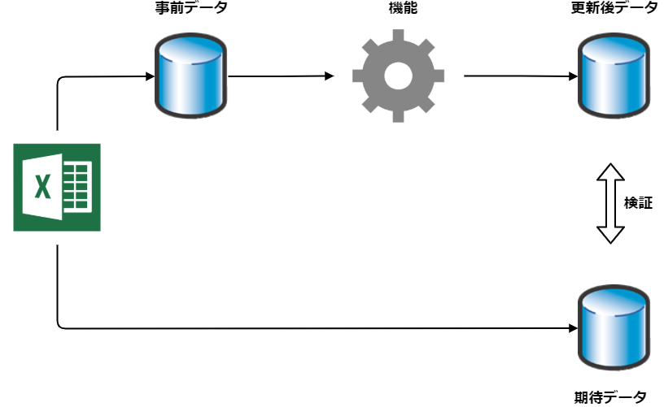

# go-exceltesting

[][godoc] [][test]

[godoc]: https://pkg.go.dev/github.com/future-architect/go-exceltesting
[test]: https://github.com/future-architect/go-exceltesting/actions/workflows/test.yml

GoでExcelを使ったテーブルドリブンテストを行うためのヘルパーライブラリです。

ローカル環境でデータベースを含めた単体テストをするために、機能で必要な事前データをデータベースに投入する必要があります。
また正しくデータが更新されたことを検証するために、機能で更新した結果と想定している結果を比較する必要があります。

`go-exceltesting` ではこうしたデータベースへの事前データの投入や、実際の更新結果と期待結果の比較をより効率的に行うためのAPIを提供します。
視認性に優れることから事前データや期待するデータはExcelを使います。



現在は PostgreSQL のみサポートしています。

## 使い方

* [データの投入方法](docs/insert.md)
* [DBの値と比較する方法](docs/compare.md)

## インストール

```
go get github.com/future-architect/go-exceltesting@latest
```
