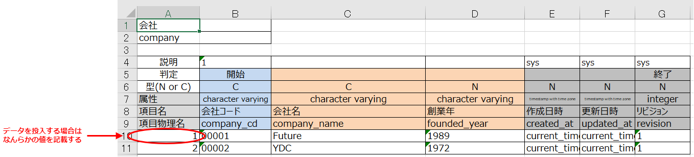

## データの投入方法

テストするための事前データをExcelからDBにデータを投入する方法は以下のようにして行います。サンプルファイルは [example.xlsx](./example.xlsx) です。

1. Excelデータにテーブル定義を記載する
2. データを記載する
3. Excelシートを `Load()` メソッドで読み込む

### 1. Excelデータにテーブル定義を記載する

例として以下のテーブル定義を考えます。

```sql
CREATE TABLE company (
  company_cd varchar(5) NOT NULL
  , company_name varchar(256) NOT NULL
  , founded_year integer NOT NULL
  , created_at timestamp with time zone NOT NULL
  , updated_at timestamp with time zone NOT NULL
  , revision integer NOT NULL
  , CONSTRAINT company_PKC PRIMARY KEY (company_cd)
) ;
```

このときExcelの設定は以下のようになります。


赤で囲っている項目は必須項目、青で囲っている項目は任意です。

#### 項目説明

* テーブル論理名
  * テーブル `company` の論理名です。`会社` というテーブル名としています
* テーブル物理名
  * テーブル `company` の物理名です
* 廃止しました ~~DB投入時の型~~
  * ~~文字列などカラムの値を `'` (シングルクォーテーション)でくくる必要がある場合は `C` 、数値など `'` でくくる必要がない場合は `N` を記載します~~
* カラム型
  * テーブルのカラムの型です。`go-exceltesting` では本項目は参照しておらず `DB投入時の型` を参照して、データを投入します
* カラム論理名
  * カラムの論理名です
* カラム物理名
  * カラム物理名です

### 2. データを記載する

`1` で定義したシートに事前データを記載します。以下の図にあるように、A列になんらかの値がある行のみ投入します。値が空の場合はスキップします。



### 3. Excelシートを `Load()` メソッドで読み込む

```go
func TestExample_Load(t *testing.T) {
	e := exceltesting.New(conn)

	e.Load(t, exceltesting.LoadRequest{
		TargetBookPath: filepath.Join("testdata", "load.xlsx"),
		SheetPrefix:    "",
		IgnoreSheet:    nil,
	})
}
```
